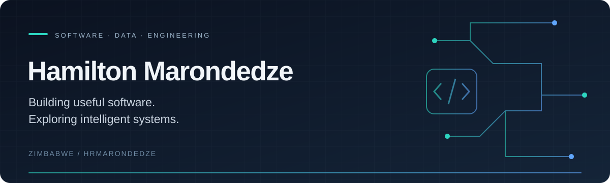

  

  <strong>Computer Engineering Student · Software Developer · Zimbabwe</strong> 
  Chinhoyi University of Technology

  
  
  

---

### A little about me

I'm Hamilton, a Computer Engineering student interested in the connection between software, data, and hardware. I build projects around practical problems in education, business, and financial data, while developing my skills in machine learning and embedded systems.

I enjoy turning an idea into a working prototype, understanding how the pieces fit together, and improving it one module at a time.

- **Building:** modular applications, mobile prototypes, and tools for working with market data.
- **Developing my skills:** Python, machine learning, backend architecture, and functional programming.
- **Exploring:** cybersecurity, digital forensics, and intelligent embedded systems.
- **Open to:** internships, junior software opportunities, and meaningful project collaboration.

### Project spotlight

These are projects I'm developing and learning from. See my pinned repositories for available code and documentation.

| Project | Problem & direction | Focus |
| :--- | :--- | :--- |
| **MT5 Companion** | Tools for accessing MetaTrader 5 data and exploring explainable market analysis. | Python · APIs · Data processing |
| **School Management System** | A modular system bringing school administration and role-based dashboards into one place. | System architecture · Access control · Education |
| **TapApZim** | A mobile wallet prototype exploring transfers and QR-based payment flows. | React Native · Expo · Mobile UI |
| **AgriZW** | A Java simulation exploring crop production, storage losses, and changing prices. | Java · Modelling · Problem solving |

### Technologies I work with

**Programming**

  
  
  
  

**Applications & data**

  
  
  
  
  

**Engineering interests**

Embedded systems · PIC microcontrollers · Sensors & instrumentation · Machine learning · Automation

### How I approach projects

**Understand the problem → Build a focused prototype → Test the behaviour → Improve the design**

I value readable code, clear documentation, and designs that can grow as requirements change. My engineering studies help me think about both the software and the systems around it.

---

  <strong>Have an opportunity or a project in mind?</strong> 
  <a href="mailto:hrmarondedze@gmail.com">hrmarondedze@gmail.com</a>

<!-- Add your verified LinkedIn URL to the contact row before publishing.
     Link project names to public repositories when their exact URLs are confirmed.
     Keep only technologies you can discuss and demonstrate in an interview. -->
